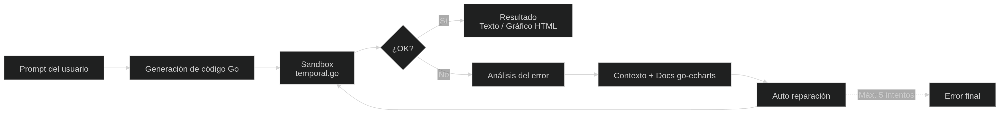
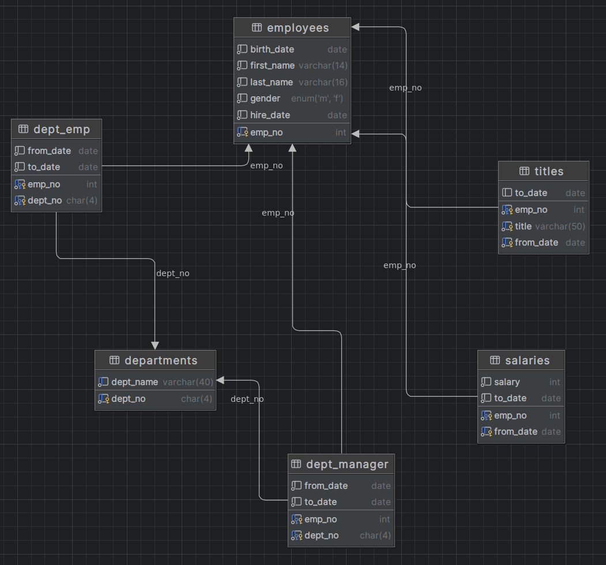

# Pocket data analyst

Agente autónomo de análisis de bases de datos con interfaz TUI basado en Code-as-Action (CodeAct). Convierte preguntas en lenguaje natural en código Go ejecutable y utiliza mecanismos de autoreparación para resolver errores durante la ejecución.

Permite consultar bases de datos, generar gráficos y obtener insights de forma interactiva desde la terminal, reduciendo la distancia entre una pregunta de negocio y el análisis de datos.

## Requisitos

| Dependencia | Verificación |
|---|---|
| Go 1.26+ | `go version` |
| Docker + Compose v2 | `docker compose version` |
| Ollama | `ollama --version` |

## Instalación
Es necesario contar con ollama instalado, el cual nos brindara el LLM mediante la API de OpenAI, se debe crear una cuenta y realizar el signin en nuestra computadora local.Por ultimo obtener el modelo indicado
```bash
# Ollama
curl -fsSL https://ollama.com/install.sh | sh
ollama serve &
ollama signin                    # requiere cuenta gratuita en ollama.com
ollama pull gpt-oss:20b-cloud

# Proyecto
make env-init                    # genera .env con valores por defecto
make setup                       # levanta MySQL 8.4 + seed dataset employees
```

## Setup y ejecución
```bash
make env-init                    # genera .env con valores por defecto (no es necesario modificar el .env)
make setup                       # levanta MySQL 8.4 + seed dataset employees
go run ./cmd/dbagent
```

## Code-as-Action

El agente transforma consultas en lenguaje natural en código Go ejecutable para resolver tareas de análisis de datos. Genera consultas a la base de datos, procesa resultados y crea visualizaciones HTML mediante `go-echarts`.

Flujo de ejecución:

* **Genera** código Go basado en la intención del usuario.
* **Ejecuta** el código de forma aislada en `sandbox_area/temporal.go`.
* **Analiza y repara** errores automáticamente (hasta 5 intentos).

Cuando detecta problemas relacionados con `go-echarts`, utiliza la documentación de la librería como contexto para guiar la corrección y permitir la autoreparación del código generado.

<p align="center">
  
</p>


## Uso
Cuando el programa arranca podra ejecutar estas acciones en orden.
- `n` → nueva sesión (wizard de conexión)
- `enter` → enviar consulta
- `↑`/`↓` → scroll
- `esc` → volver a lista de sesiones
- Gráficos se abren automáticamente en el navegador

## Ejemplos de consultas
La base de datos luce asi:
<p align="center">
  
</p>

Consultas de ejemplo sobre el dataset employees (en caso de no revisar los registros de la DB):
- Obten los 10 cargos con mayor salario promedio entre 1986 y 1993. Para cada cargo, muestra la evolucion de su salario promedio año a año durante ese periodo, permitiendo analizar cómo cambiaron sus ingresos a lo largo del tiempo. Representalo en un grafico de lineas
- Comparacion de salario promedio del cargo manager por género en el año 1992 representado en grafico de barras, usa las etiquetas 'Hombre' y 'Mujer'
- Distribución porcentual de empleados por departamento representalo en un gráfico de pie

## Comentarios adicionales 

1. La carpeta /internal/lib/go-echarts contiene la documentación oficial de la librería y está incluida como fuente de contexto para el agente. Su objetivo es facilitar la generación y corrección del código cuando se requieren funcionalidades específicas de visualización.
2. Los gráficos generados se almacenan en sandbox_area/charts. En caso de un fallo durante la ejecución, estos archivos pueden ser revisados directamente para facilitar el diagnóstico del problema.
